Detailed Operation
------------------

Main Display
^^^^^^^^^^^^
|main_screen_corner|

The main screen (unless swapped) shows a live stream form the camera.  At the top left, the camera exposure time and
frame rate are displayed.  At the top right, the mouse cursor position (x, y) is displayed.

Keyboard
........

The program will respond to certain keyboard entries as follows:

+------------+--------------------------------------------------+
| Key        | Function                                         |
+============+==================================================+
| ``A``      | Delete All arrows and ROIs.                      |
+------------+--------------------------------------------------+
| ``C``      | Capture frame and store to the capture palette.  |
+------------+--------------------------------------------------+
| ``R``      | Start or stop recording.                         |
+------------+--------------------------------------------------+
| ``S``      | Swap role of live and captured screens.          |
+------------+--------------------------------------------------+
| ``T``      | Toggle exposure groups.                          |
+------------+--------------------------------------------------+
| ``Delete`` | Delete activated ROI or arrow.                   |
+------------+--------------------------------------------------+

ROIs
....
|roi|

An *ROI* is a region of interest - a closed polygon.  It can be used purely as graphical object to mark up the
display but it also has a function in setting the display contrast/brightness. To draw an ROI, start with a
double-click at the first vertex, single clicks of the left mouse button for each subsequent vertex,
and then a double click to define the final vertex and close the polygon.

The ROI can be activated by hovering over the ROI so that it changes color then single-click the left mouse button.
The vertices will reappear.  Once activated the ROI can be moved by dragging from somewhere inside the ROI
polygon, or any one of the vertices can be moved by dragging from inside that point.

To delete the ROI, activate it and press the delete key.

Arrows
......
|arrow|

An arrow is purely graphical.  It has no function.  Draw it by aiming the mouse cursor at the live screen where
you want the arrow head to appear and then dragging to form the tail.  When you release the mouse button, the arrowhead
will appear.  To activate an arrow, you must click on th arrow head.  Arrows can't be moved.  Delete an arrow by
activating it then pressing the delete key.

Contrast/Brightness
^^^^^^^^^^^^^^^^^^^
|contrast_brightness|

This section of the screen controls the brightness and contrast settings.  There is a live histogram displaying the
distribution of pixel values.  The horizontal axis always shows the full range of possible pixel values (256 for 8-bit
cameras, 1024 for 10-bit cameras, 4096 for 12-bit).  There are slider controls above and below the histogram to control
the brightness/contrast window.

Keep in mind that the contrast/brightness controls affect the display
parameters - they do not control camera settings.  If the display is very dim, it may be better to increase
the exposure time for a better signal to noise ratio.

+---------------+-------------------------------------------------------------------+
| Control       | Function                                                          |
+===============+===================================================================+
| upper slider  | Sets the pixel value corresponding to fully-saturated white       |
+---------------+-------------------------------------------------------------------+
| lower slider  | Sets the pixel value corresponding to black                       |
+---------------+-------------------------------------------------------------------+
| |b_reset|     | Resets contrast/brightness to 0=black, 100%=white                 |
+---------------+-------------------------------------------------------------------+
| |b_global|    | Sets contrast/brightness to include full range of pixels.  I.e.   |
|               | black is set to the minimum pixel value, white to the max.        |
+---------------+-------------------------------------------------------------------+
| |b_roi|       | Sets contrast/brightness to the range of pixels contained within  |
|               | the ROI                                                           |
+---------------+-------------------------------------------------------------------+

Exposure/Inter-Frame Interval (IFI) Controls
^^^^^^^^^^^^^^^^^^^^^^^^^^^^^^^^^^^^^^^^^^^^
|exposure_controls|

+---------------+------------------------------------------------------------------------+
| Control       | Function                                                               |
+===============+========================================================================+
| |g_bright|    | select exposure group 1 - Bright/NIR - exposure time (ms) and IFI (s)  |
+---------------+------------------------------------------------------------------------+
| |g_fluor|     | select exposure group 2 - Fluorescence - exposure time (ms) and IFI (s)|
+---------------+------------------------------------------------------------------------+
| |b_cal|       | start flat-field calibration                                           |
+---------------+------------------------------------------------------------------------+

One of the two exposure groups is active at a time.  Selecting one deactivates the other. Each exposure group is
associated with an exposure duration that's selected from a drop-down list of possible exposure settings.  The
exposure group is also associated with the contrast/brightness settings so when toggling between groups, the
contrast/brightness will also be retained.

Inter-frame interval is controlled by the second drop-down in each group.  A non-zero inter-frame interval
creates a longer gap between frames.  A non-zero inter-frame interval must be selected to activate time-lapse
recording.

Flat-field calibration is performed while no illumination is present.  The software will cycle through all the
selectable exposure settings and record a black image.  This dark-field correction will be subtracted from
all subsequent live streams.  The dark-field images are also stored (if enabled) to a folder and loaded (if
enabled) when the program starts up.

Relationship Between Exposure Time and Frame Rate
.................................................
With the inter-frame interval time set to zero, the frame rate is determined by the software.  The camera
frame rate cannot be higher than the inverse of the exposure time.  So, for example, if the exposure time
is 400 ms, the frame rate will be at most 2.5 FPS.  There is also a limit imposed by the software of (currently) 5
frames per second so reducing the exposure time below 200 ms doesn't increase the frame rate.

Capture Palette
^^^^^^^^^^^^^^^
|capture_palette|

+---------------+-------------------------------------------------------------------+
| Control       | Function                                                          |
+===============+===================================================================+
| group <hms>   | capture palette tag name derived from the creation time           |
+---------------+-------------------------------------------------------------------+
| |b_reset|     | reset palette by clearing images and creating a new group tag     |
+---------------+-------------------------------------------------------------------+
| slider        | page through stack of captured frames                             |
+---------------+-------------------------------------------------------------------+
| |b_capture|   | capture the current frame                                         |
+---------------+-------------------------------------------------------------------+
| |b_swap|      | swap the roles of the main and capture palette screens            |
+---------------+-------------------------------------------------------------------+
| |b_record|    | start or stop recording frames to capture palette                 |
+---------------+-------------------------------------------------------------------+

The capture palette keeps track of captured frames.  Add a new frame by pressing the |b_capture| button or ``C`` on
the keyboard.  Add time-lapse recordings to the palette by pressing the |b_record| button or ``R`` on
the keyboard. Scroll through the stack (deck) of captured frames using the slider control.

Captured frames are saved to image files in a folder whose name corresponds to the group
name (i.e. the palette creation time as HHMMSS). Individual frames are named sequentially.
The format of stored captured frames is 16-bit gray-scale TIFF.

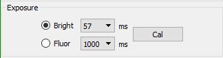
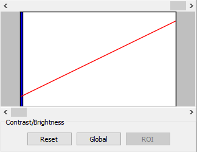
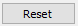
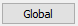
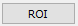
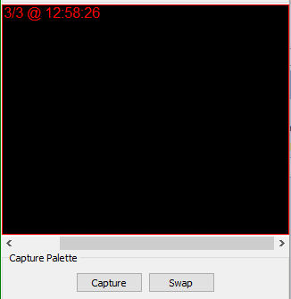
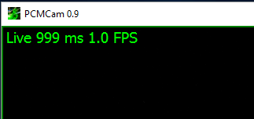
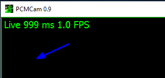
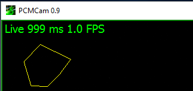
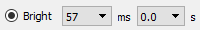
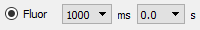
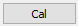
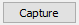
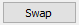
.. |b_record| image:: graphics/b_record.png

