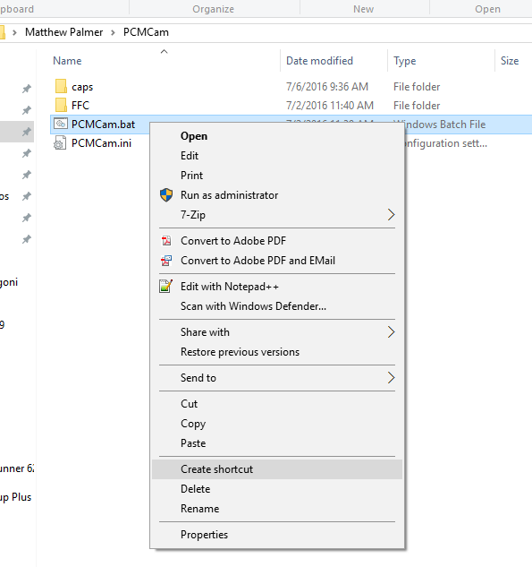
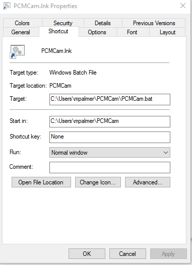
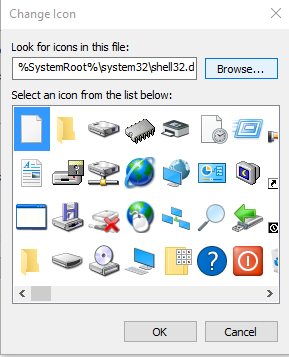

Initial Invocation
------------------

Initial invocation is by the command line.  From the windows command prompt type::

    python PCMCam.py <n>

where <n> is replaced by a single-digit as follows:

+---+-------------------------------+
| n | Camera                        |
+===+===============================+
| 0 | Thorlabs/IDS DCx camera       |
+---+-------------------------------+
| 1 | webcam                        |
+---+-------------------------------+
| 2 | pseudo-camera (noise)         |
+---+-------------------------------+

The first time PCMCam is run on a computer (or by a user of a computer) it simply prepares some
files and directories [1]_ and then exits.  In the table below, the tilde (``~``) is expanded as the
Windows user home diretory, usually e.g., ``C:\Users\joeavg``, for a user named ``joeavg``.

.. [1] Note that the folders are not actually created until they are needed so the first invocation
    really only creates the ``~\PCMCam`` folder.

+-----------------+-----------------------------------------+
| Folder          | Purpose                                 |
+=================+=========================================+
|``~\PCMCam``     | user/program home directory.            |
+-----------------+-----------------------------------------+
|``~\PCMCam\FFC`` | folder of flat-field-calibration files  |
+-----------------+-----------------------------------------+
|``~\PCMCam\caps``| folder for storing captured images      |
+-----------------+-----------------------------------------+

+-----------------+------------------------------------------------+
| File            | Purpose                                        |
+=================+================================================+
|``PCMCam.ini``   | initialization file - you can edit this        |
+-----------------+------------------------------------------------+
|``PCMCam.bat``   | batch file - can be used to invoke the program |
+-----------------+------------------------------------------------+

Folder locations, along with a number of other program options, can be controlled by overriding the default
definitions in PCMCam.ini.  That's the reason for having
a special invocation - you can run the program, edit the files, then subsequent runs make use of the modified files.

The camera number, ``n``, as entered on the initial invocation command is written to the batch file so that
subsequent invocation using the batch file cause the same camera to be selected.

The initial invocation is performed when the program does not see an initialization file.  So, to reset the system
and cause a new set of files and folders to be created, simply delete (or rename) the file ``PCMCam.ini``.

Preparing the Quick Launch Shortcut
^^^^^^^^^^^^^^^^^^^^^^^^^^^^^^^^^^^
In the media subdirectory of the package directory (currently ``...\PCMCamV09\media``), there is an
icon file that can be installed in a windows shortcut to the ``.bat`` file to create an object that can be launched
by windows.  To do this, follow these steps:

#. Use Windows Explorer to locate the ``.bat`` file that was created by the initial program invocation.
#. Right click and select *Create shortcut*.

    |shortcut_to_bat|
#. Rename the shortcut, ``PCMCam.bat - Shortcut`` as ``PCMCam.lnk``.
#. Select it, right-click, select *Properties* then press the *Change Icon...* button.

    |change_icon|
#. There will be a warning to say that the file does not contain an icon, just agree to that and then proceed to
   the next dialog and press *Browse...*

   |icon_browse|
#. Navigate to the ``media`` subfolder of the package directory and select the ``patch_icon.ico`` file.
#. Now the file ``PCMCam.lnk`` can be moved or copied to the desktop as a quick launch button.

